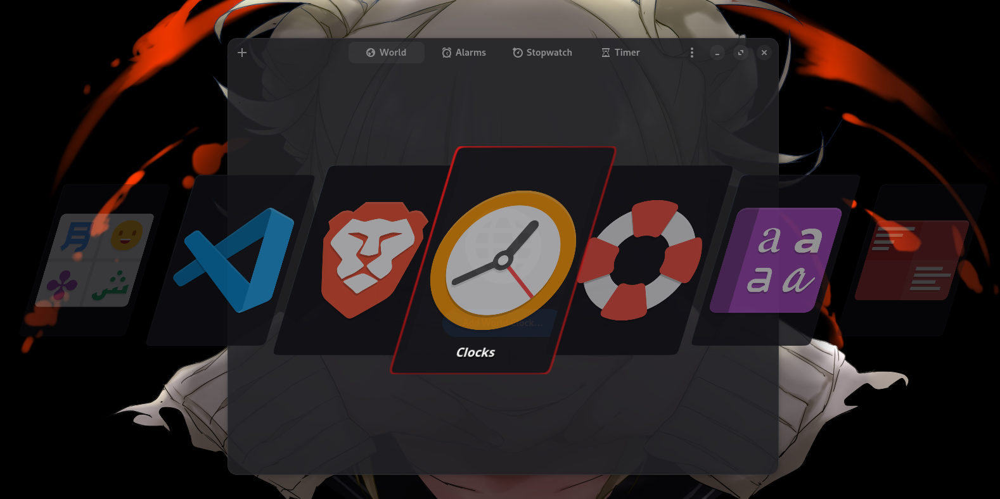
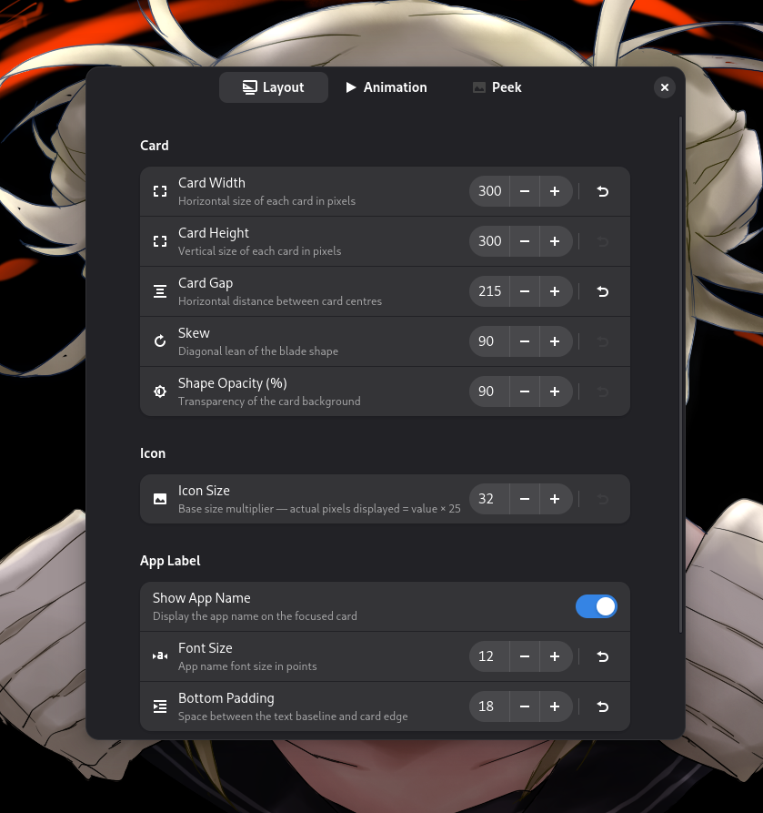

  
  <h1>Chakra Switch</h1>
  
<strong>A modern visual Alt+Tab replacement for GNOME Shell</strong>

  
Developed by <strong>Narkagni</strong>

<h2>Overview</h2>

  Chakra Switch replaces the default GNOME Alt+Tab with a sleek diagonal blade card switcher
  Each open window is represented as a stylized skewed card with a live icon watermark smooth entry animations and an optional peek preview that shows the actual window behind the overlay
  Everything is configurable through a native LibAdwaita preferences window.

<h2>Gallery</h2>

  <strong>The Switcher & Preferences:</strong> Minimal design with deep customization

  
  

<h2>Key Features</h2>

  
<strong>Diagonal Blade Layout</strong>

  

    Open windows are displayed as parallelogram shaped cards arranged in a horizontal row
    The focused card is highlighted with a red border and scales up slightly
    With more than 5 windows the layout becomes a scrollable carousel only the nearest cards are visible
  

  
<strong>Live Peek Preview</strong>

  

    When a card is focused the actual window content appears as a scaled down live clone
    centered behind the switcher All other windows fade out so the preview is always clean
    Peek can be toggled and fully tuned (opacity, scale, animation speed) in preferences
  

  
<strong>Smooth Animations</strong>

  

    Cards animate in from the center outward the focused card arrives first flanking cards
    follow with a configurable stagger delay Focus transitions are fluid with independent
    duration and scale controls
  

  
<strong>Deep Customization</strong>

  

    Nearly every visual parameter is exposed in the preferences window with live reset buttons
  

  <ul>
    <li><strong>Card:</strong> Width, height, gap, skew angle, background opacity</li>
    <li><strong>Icon:</strong> Size multiplier for the watermark icon inside each card</li>
    <li><strong>App Label:</strong> Toggle, font size, and bottom padding of the focused app name</li>
    <li><strong>Animation:</strong> Entry stagger delay, entry duration, focus duration, focus scale</li>
    <li><strong>Peek Preview:</strong> Enable/disable, max scale, opacity, fade-in and fade-out speed</li>
  </ul>

<h2>Installation</h2>

<h3>Requirements</h3>
<ul>
  <li>GNOME Shell 45 - 50</li>
  <li><code>libglib2.0-bin</code> (required for schema compilation)</li>
</ul>

<h3>Install from Source</h3>

<strong>1. Clone the repository</strong>

<pre>git clone https://github.com/NarkAgni/chakra-switch.git
cd chakra-switch</pre>

<strong>2. Install using Make</strong>

<pre>make install</pre>

<strong>3. Restart GNOME Shell</strong>

  For <strong>X11</strong>: Press <code>Alt+F2</code>, type <code>r</code>, and hit Enter. 
  For <strong>Wayland</strong>: Log out and log back in.

<strong>4. Enable the extension</strong>

<pre>gnome-extensions enable chakra-switch@narkagni</pre>

<strong>To uninstall:</strong>

<pre>make uninstall</pre>

<h2>Usage</h2>

<ul>
  <li><strong>Open Switcher:</strong> <code>Alt+Tab</code></li>
  <li><strong>Cycle Forward:</strong> <code>Alt+Tab</code> / <code>→</code> / <code>↓</code></li>
  <li><strong>Cycle Backward:</strong> <code>Alt+Shift+Tab</code> / <code>←</code> / <code>↑</code></li>
  <li><strong>Activate Window:</strong> Release <code>Alt</code> or click a card</li>
  <li><strong>Scroll:</strong> Mouse wheel cycles through cards (carousel mode)</li>
</ul>

<h2>Support Development</h2>

  This extension is free and open source If Chakra Switch improves your workflow, consider supporting the development

  
  &nbsp;&nbsp;
  

 

  
<strong>Crypto Addresses</strong>

   
  
<strong>Bitcoin (BTC):</strong>

  <pre>1GSHkxfhYjk1Qe4AQSHg3aRN2jg2GQWAcV</pre>

  
<strong>Ethereum (ETH):</strong>

  <pre>0xf43c3f83e53495ea06676c0d9d4fc87ce627ffa3</pre>

  
<strong>Tether (USDT - TRC20):</strong>

  <pre>THnqG9nchLgaf1LzGK3CqdmNpRxw59hs82</pre>

License: GPL-3.0
